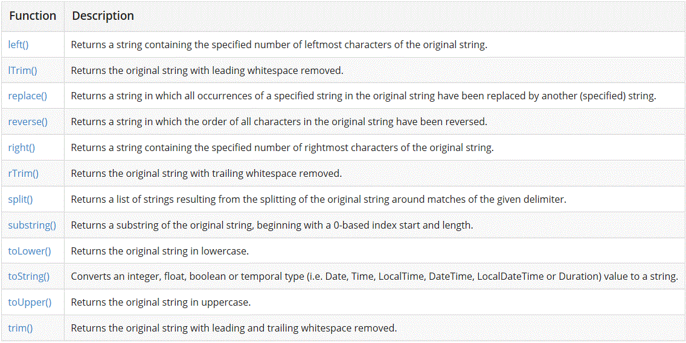

## Query Basics - Aggregation and other basic functions

### Remove duplicates with DISTINCT

Get actors who earned greater than 10 million dollars in a movie and remove duplicate entries  
```
MATCH (actor:Person)-[role:ACTED_IN]->(:Movie)
WHERE role.earnings > 10000000
RETURN DISTINCT actor.name
```

### Aggregation Functions  
```
COUNT, AVG, SUM, MIN, MAX
```
COUNT:
```
MATCH (actor:Person{name: 'Tom Hanks'})-[:ACTED_IN]->(movie:Movie)
RETURN COUNT(movie)
```
SUM:
```
MATCH (actor:Person{name: 'Tom Hanks'})-[role:ACTED_IN]->(movie:Movie)
RETURN SUM(role.earnings)
```
AVG:
```
MATCH (actor:Person{name: 'Tom Hanks'})-[role:ACTED_IN]->(movie:Movie)
RETURN AVG(role.earnings)
```
MIN & MAX:
```
MATCH (actor:Person{name: 'Tom Hanks'})-[role:ACTED_IN]->(movie:Movie)
RETURN MIN(role.earnings), MAX(role.earnings)
```

### String Functions



### MATH Functions  
[See Cypher Developers Manual](https://neo4j.com/docs/developer-manual/3.4/cypher/functions/#header-query-functions-numeric)


[Back](../README.md)